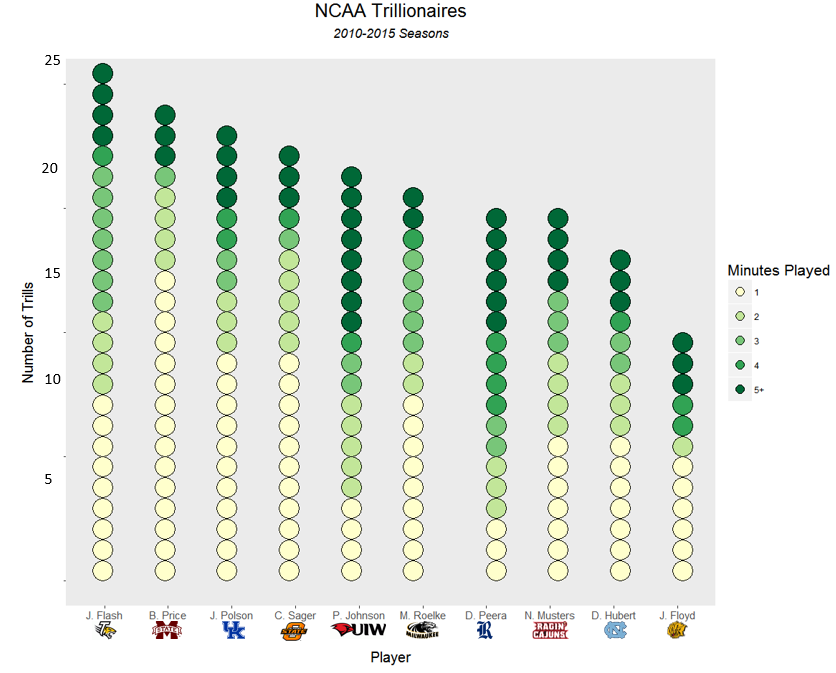

# Trillionaires of College Basketball

The "trillion" is the most irrelevant statistic in all of basketball. This is due to just that, the metric measures the irrelevance of a basketball player.

How does one achieve a trillion? Imagine a walk-on at the end of a blow-out college basketball game:

- He checks in during the final minute

- Fails to record a single stat during the game (no points, rebounds, assists, turnovers, etc.)

  - *This* would be a **one**-trillion (a one in the first column of the box score, followed by 12*ish* zeros) 
  
  - If he had played two minutes, it would be a two trillion... and so on.

On this site, we will explore the most irrelevant bench-warmers in college basketball since the 2010-2011 season (when box-scores became available on [Sports Reference](http://www.sports-reference.com/cbb/boxscores/)).  Join me in giving some undeserved attention to these players. 

## Who totaled the most minutes in their Trillion games?

   

It looks like Phillip Johnson from Incarnate Word is the head of the trillion club with 99 minutes... But wait, is he really?

According to the father of the trillion, Mark Titus, the trillion ["loses its value"](http://clubtrillion.blogspot.com/2009/12/abhor-more-than-four.html?m=0) beyond 4 minutes of action.  So, let's look at how these same players compare in terms of number of trillions recorded, and color each Trillion by it's number of minutes:

  

Phillip Johnson may have dominated the total minutes of Trillions, but when we use the 'No More Than Four' Rule, we see a new picture.   From the graphic above, you can see that PJ had the most 5+ minute games, with 8 to his name -- including a stunning [23 trillion against Oklahoma](http://www.sports-reference.com/cbb/boxscores/2015-11-24-oklahoma.html).  So disregarding those 5+ minute games reveals a new champion, [Jamel Flash from Towson](http://www.towsontigers.com/roster.aspx?rp_id=5946). Jamel had the most overall Trillions of this group with 25, but he also recorded a great amount of 2-4 minute trillions.  Congratulations to Jamel Flash, our OFFICIAL TRILLION CHAMPION!

P.S. That 23 trillion by Phillip Johnson wasn't even the longest one in this time span. 26 minutes (65% of a game) was done accomplished by both [Travis Berry of Sacred Heart](http://www.sports-reference.com/cbb/boxscores/2015-11-13-sacred-heart.html) and [Carlton Lowe of Grambling](http://www.sports-reference.com/cbb/boxscores/2016-01-02-grambling.html))
 

### Coming soon: A searchable table (with box-score links) of all Trillions since the 2010-11 Season
